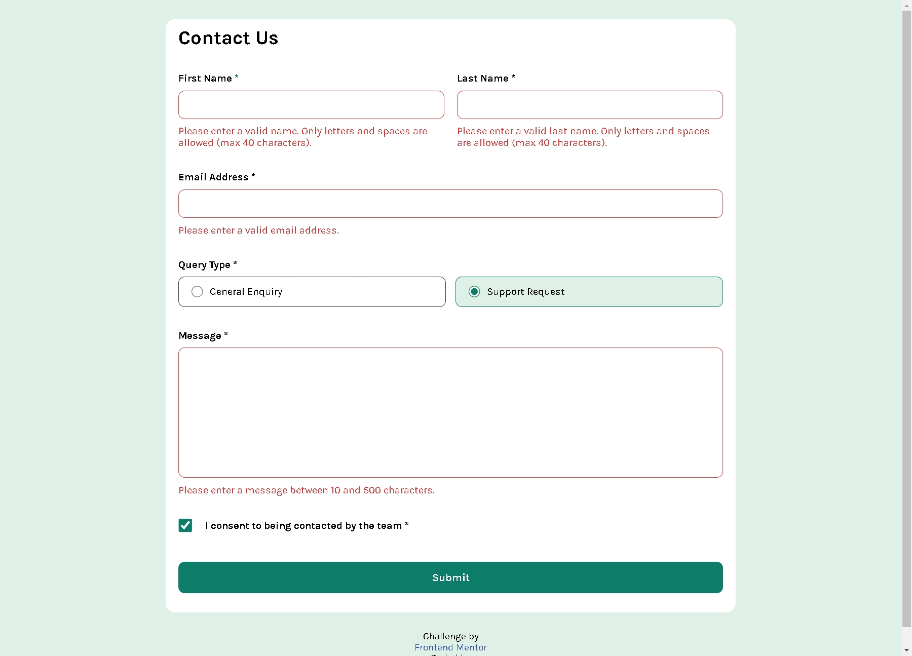
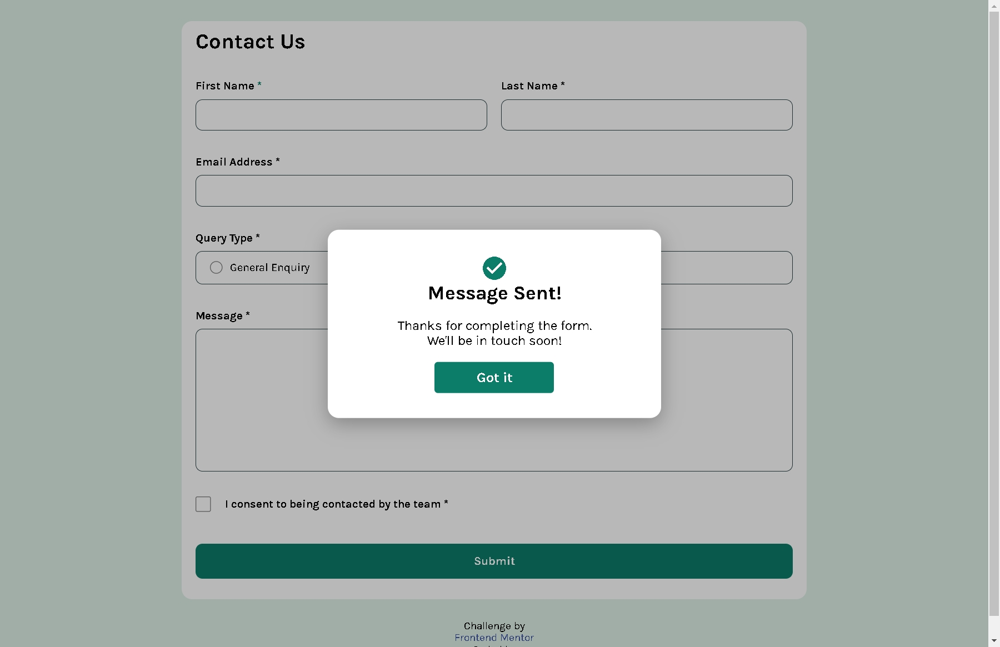
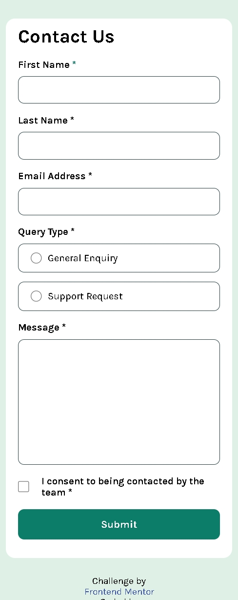

# Frontend Mentor - Contact Form Solution

This is my solution to the [Contact Form challenge on Frontend Mentor](https://www.frontendmentor.io/challenges/contact-form--G-hYlqKJj).  
The goal was to build a responsive contact form with custom validations and a success modal.

---

## 🚀 Overview

### The challenge
Users should be able to:
- Complete the form and see a success modal upon submission.
- Receive clear validation messages for each input type.
- Navigate and submit the form using only the keyboard.
- View optimal layout on all device sizes.
- See hover and focus states for all interactive elements.

## 🖼️ Screenshots

| Desktop view | Success modal | Mobile view |
|---------------|----------------|--------------|
|  |  |  |

> 💡 Tip: Guarda tus imágenes en una carpeta llamada `assets/screenshots` dentro del proyecto y nómbralas claramente.  
> Ejemplo: `desktop-view.png`, `modal-success.png`, `mobile-view.png`.

### 🖼️ Live Preview
- **Live site:** [eduardo-contact-form.netlify.app](https://eduardo-contact-form.netlify.app/)
- **Solution repo:** [github.com/edd-dev02/contact-form-main](https://github.com/edd-dev02/contact-form-main)

---

## 🧩 Built With
- **HTML5**
- **CSS3 (BEM methodology)**
- **Vanilla JavaScript**

---

## 💡 What I Learned
In this project, I learned how to handle **custom validations** for different input types, including text, radio buttons, and checkboxes.  
Implementing the **validation styles and logic** for showing and hiding error states was challenging but rewarding.  
Additionally, I learned how to **create, animate, and control a modal window**, something I had never done before.

---

## 📚 Useful Resources
- 🎥 [Validación de formularios con JavaScript](https://www.youtube.com/watch?v=cEKDyzoTXb4)  
- 🎥 [Validación de formularios paso a paso](https://www.youtube.com/watch?v=s3pC93LgP18&t=1s)  
- 🎥 [Cómo crear un modal con HTML, CSS y JS](https://www.youtube.com/watch?v=InQxRD80TW4&list=LL&index=21&t=34s)

---

## 👨‍💻 Author
- **Website/Portfolio:** [eduardo-contact-form.netlify.app](https://eduardo-contact-form.netlify.app/)
- **Frontend Mentor:** [@edd-dev02](https://www.frontendmentor.io/profile/edd-dev02)
- **GitHub:** [@edd-dev02](https://github.com/edd-dev02)
- **LinkedIn:** [Eduardo Sandoval](https://www.linkedin.com/in/eduardosandoval02/)

---

### ✅ Summary
This project helped me strengthen my understanding of **DOM manipulation, form validation logic, and user feedback design**.  
It’s one of those small but complete exercises that combine accessibility, design, and JavaScript fundamentals.
